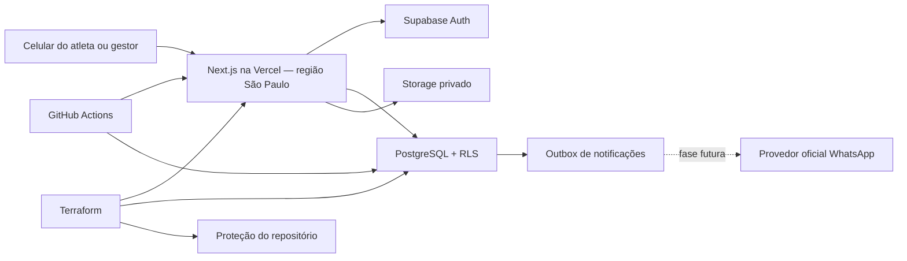

# Arquitetura

## Objetivo

O Fut7 é um SaaS multi-time. A mesma pessoa pode administrar vários times, cada time tem sua página pública por slug e nenhum dado privado pode atravessar a fronteira entre times.

## Contextos do produto

1. **Identidade e acesso** — Supabase Auth identifica a pessoa; `team_memberships` define seu papel em cada time.
   `team_invitations` representa o acesso pendente antes de existir uma associação ativa.
2. **BID do time** — `athletes` guarda o registro esportivo; `athlete_private` isola telefone, e-mail, nascimento e observações; `athlete_position_preferences` ordena posições por modalidade.
3. **Agenda** — `event_series` descreve uma recorrência e `events` materializa cada ocorrência. Jogos avulsos não precisam de série.
4. **Presença** — `event_attendance` registra a resposta do atleta para uma ocorrência específica.
5. **Divisão e escalação** — `event_squads` representa os times de um racha; `lineup_spots` posiciona apenas atletas confirmados no evento.
6. **Comunicação** — `communication_consents` registra opt-in/opt-out e evidência; `notification_outbox` desacopla eventos do domínio do futuro provedor de WhatsApp.
7. **Auditoria** — `audit_logs` registra mudanças sensíveis de estado sem armazenar o conteúdo completo da PII.

## Componentes

O navegador usa apenas a chave publicável. Operações comuns são autorizadas no PostgreSQL por RLS. A chave secreta que ignora RLS existe somente no servidor e está limitada a RPCs estreitas: cadastro público previamente validado com Turnstile e prévia não sensível de um convite por token.

## Tenancy e papéis

- `owner`: controle total do time; o último owner não pode ser removido.
- `admin`: administra time, elenco e permissões operacionais.
- `manager`: administra elenco, agenda e escalações.
- `player`: reservado para acesso do atleta, sem acesso administrativo.

Todas as tabelas de domínio carregam `team_id` ou dependem de uma chave composta que o garante. As políticas RLS consultam associação ativa ou vínculo do atleta. PII só é visível ao próprio atleta e à equipe administrativa autorizada.

## Rotas

- `/`: apresentação do produto;
- `/t/{slug}`: perfil público e elenco com opt-in;
- `/t/{slug}/cadastro`: solicitação pública, sempre criada como `pending`;
- `/auth/login`, `/auth/sign-up`, `/auth/forgot-password`, `/auth/update-password`: identidade;
- `/invite/{token}`: prévia pública mínima de convite; o aceite exige sessão e e-mail verificado;
- `/app`: roteador entre convites pendentes, criação de time e contexto existente;
- `/app/new-team`: criação guiada do time;
- `/app/{teamSlug}`: painel do time.

## Convites administrativos

- o token aleatório tem 256 bits e apenas seu SHA-256 é persistido;
- a prévia por token revela somente time, papel e validade; não concede acesso;
- descoberta e aceite são vinculados ao e-mail confirmado em `auth.users`;
- aceite/recusa usa bloqueio de linha e transação única para impedir replay e corrida;
- owner pode convidar admin ou manager; admin pode convidar somente manager;
- nenhuma associação ativa é criada antes da confirmação explícita do destinatário.

A criação de times também é uma RPC estreita: exige e-mail confirmado, serializa
requisições concorrentes por usuário e aplica limites de frequência e propriedade.
O papel `authenticated` não possui `INSERT` direto em `teams`.

## Recorrência

Uma série não é a partida. Um processo idempotente deve materializar ocorrências futuras, por exemplo para os próximos 60 dias, preservando exceções feitas em uma ocorrência. A regra de recorrência deve ser armazenada em formato iCalendar RRULE e interpretada no fuso do time. Nunca recalcule o histórico.

## WhatsApp-first

- o telefone é normalizado em E.164;
- consentimento e sua versão/evidência são dados de domínio;
- mensagens são comandos idempotentes na outbox, não chamadas diretas no fluxo do usuário;
- todo item possui status, tentativas, disponibilidade e chave de deduplicação;
- links devem levar direto à confirmação de presença, com token curto, escopo mínimo, expiração e uso único;
- templates e webhooks do provedor ficam atrás de adaptadores, evitando acoplamento do domínio à Meta ou a um BSP.

## Decisões de plataforma

- Next.js App Router e Server Actions para reduzir superfície de API;
- Supabase PostgreSQL como fonte da verdade, Auth e Storage privado;
- Vercel Functions em `gru1`, perto do banco selecionado em São Paulo;
- migrações SQL e testes pgTAP versionados;
- Terraform para recursos remotos e GitHub Actions para validação/deploy;
- nenhum estado de negócio autoritativo no navegador.
